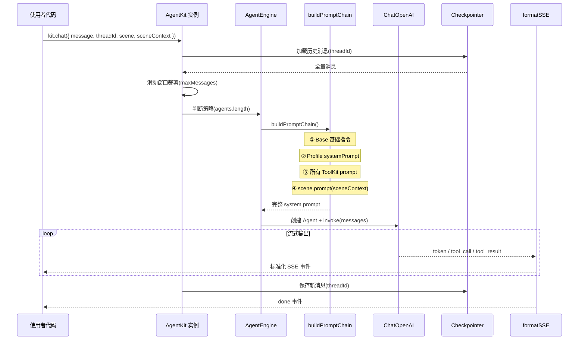
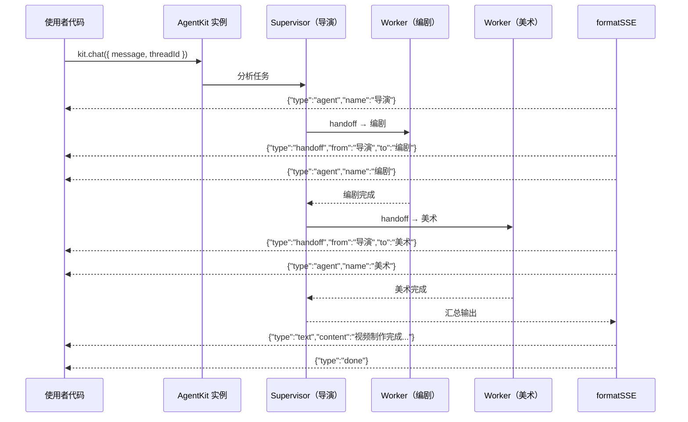

# @lilo-agent/core — 产品文档

## 一、用户需求

### 1.1 问题背景

LangChain 生态功能强大但 API 复杂、概念分散，直接使用存在以下痛点：
- 构建一个可流式输出的 Agent 需要手动组装 LLM、Tools、StateGraph、Callbacks 等多个模块，样板代码冗长
- 单 Agent 与多 Agent 协调（Supervisor 模式）的构建方式差异大，缺乏统一抽象
- 工具（Tools）和场景提示词散落在各处，难以跨项目复用
- SSE 事件流格式没有标准约束，前后端对接成本高

### 1.2 用户目标

构建 `@lilo-agent/core` TypeScript 库，封装 LangChain 编排复杂性。使用者只需关注三件事：

1. **ToolKit**（静态能力包）：按领域分组的工具集 + 使用策略 Prompt，全员共享
2. **Profile**（角色身份）：只写 name + systemPrompt + model
3. **Scene**（动态运行时上下文）：注入当前业务状态的 prompt 模板 + 生命周期回调

库自动处理：Prompt 4 层拼接、单/多 Agent 策略选择、SSE 流式输出。
记忆持久化与调试观测交给 LangChain 生态已有方案，库仅透传配置。

### 1.3 核心设计决策（讨论沉淀）

| # | 决策 | 结论 | 理由 |
|---|------|------|------|
| 1 | Scene 是否保留 | ✅ 保留 | Profile/ToolKit 是静态的，Scene 负责注入动态运行时上下文（当前页面状态、选中元素等） |
| 2 | Team 是否独立概念 | ❌ 融入参数 | `agents[]` + `supervisor?` 参数即可表达，不需要额外类型 |
| 3 | 单/多 Agent 是否区分 API | ❌ 统一入口 | 引擎内部根据 agents 数量自动判断策略，用户无感 |
| 4 | ToolKit 归属 | Scene 决定，Agent 共享 | ToolKit 在 createAgentKit 注册为全局能力池，Scene 声明当前场景需要哪些 ToolKit，场景内所有 Agent 共享这些 ToolKit。避免工具列表臃肿导致 token 浪费和 LLM 误选（详见 1.7） |
| 5 | 全局注册表 vs 实例持有 | 实例持有 | 全局注册表导致测试污染、多实例不可能、加载顺序依赖 |
| 6 | 核心 API 是否绑定 Express | ❌ 分离 | `kit.chat()` 是核心，`kit.handleRequest()` 是可选 HTTP 适配 |
| 7 | 记忆持久化 | LangGraph Checkpointer | 透传配置（MemorySaver / PostgresSaver），库不自建 |
| 8 | 上下文窗口管理 | 滑动窗口，库内置 | 默认取最近 N 条消息，Checkpointer 仍全量存储，库自动裁剪 |
| 9 | 调试观测方案 | LangFuse 自部署 | 透传 `callbacks` 配置项，库不内置调试功能 |
| 10 | API 文档 | TypeDoc 自动生成 | 从 TSDoc 注释自动生成，与代码永远同步，零维护成本 |

### 1.4 使用者视角的最终 API

```typescript
import { createAgentKit, defineScene } from '@lilo-agent/core'
import { MemorySaver } from '@langchain/langgraph'
import { CallbackHandler } from '@langfuse/langchain'

// 1. 定义能力包（静态能力池）
const canvasToolKit = {
  name: 'canvas',
  tools: [bindElementTool, bindTrackTool],
  prompt: '画面调整时优先使用 canvas 工具...',
}

// 2. 定义角色（只写 Prompt）
const director = {
  name: '导演',
  systemPrompt: '你是一位视频导演...',
  model: 'gpt-4o',
}

// 3. 定义场景（声明需要哪些 ToolKit + 动态运行时上下文）
const timelineScene = defineScene({
  name: 'timeline-editing',
  toolkits: ['canvas', 'ai'],              // ← Scene 决定此刻用哪些能力
  prompt: (ctx) => `用户在时间线编辑器，视频时长: ${ctx.duration}秒`,
  onToolEnd: (toolName, result) => {
    if (toolName === 'bindTrack') refreshTimeline()
  },
})

// 4. 创建实例（注册全局能力池，服务器启动时执行一次）
const kit = createAgentKit({
  toolkits: [canvasToolKit, aiToolKit, assetToolKit],   // 全局能力池
  agents: [director, screenwriter],
  supervisor: '导演',
  checkpointer: new MemorySaver(),
  maxMessages: 50,
  callbacks: [new CallbackHandler()],
})

// 5. 核心调用（Scene 过滤出 canvas + ai 工具，所有 Agent 共享）
const stream = await kit.chat({
  message: '帮我调整第3秒的转场',
  threadId: 'thread-001',
  scene: timelineScene,
  sceneContext: { duration: 30 },
})

// 6. Express 集成（可选薄封装）
app.post('/chat', kit.handleRequest())
```

### 1.5 关键约束

| 维度 | 约束 |
|------|------|
| 运行环境 | Node.js |
| 部署环境 | Docker（开发 WSL + 生产 Ubuntu） |
| HTTP 框架 | Express（可选适配，不耦合核心） |
| 包管理 | npm |
| 构建工具 | tsup |
| LangChain 依赖方式 | peerDependencies |
| 记忆持久化 | LangGraph Checkpointer（透传） |
| 调试观测 | LangFuse 自部署（透传 callbacks） |
| 语言 | TypeScript（严格模式） |

### 1.6 步骤拆分

#### 主流程（步骤 1）
- 单 Agent：Profile + ToolKit → kit.chat() → 流式响应
- Prompt 3 层拼接（Profile → ToolKit → Scene）
- Scene 动态 prompt 注入 + ToolKit 过滤
- Checkpointer / Callbacks 透传
- SSE 协议层 + Express 适配
- npm 包结构 + tsup 构建

#### 功能步骤（步骤 2）
- 多 Agent（SupervisorStrategy + supervisor 参数）
- SSE handoff / agentName 事件
- Scene.onToolEnd 生命周期委托

#### 优化步骤（步骤 3）
- 错误处理 & 重试
- 自定义 BuildStrategy 扩展点
- TypeDoc API 文档生成（npm run docs）
- Debug Panel 调试面板

### 1.7 ToolKit 归属设计理由

**问题**：如果所有 Agent 直接共享全部 ToolKit 会怎样？

假设全局有 4 个 ToolKit，每个 5 个工具 = 20 个工具：

| 场景 | 实际需要 | 全共享时 | 浪费 |
|------|---------|---------|------|
| 时间线编辑 | canvas + ai = 10 个工具 | 20 个工具 | 10 个无用工具 |
| 脚本编辑 | ai = 5 个工具 | 20 个工具 | 15 个无用工具 |

**全共享带来的三个问题**：

1. **Token 浪费**：每个工具的 schema 约 100-200 tokens，多 10 个无用工具 = 多 1500 tokens/请求。1000 用户 × 10 轮对话 = 每天浪费 1500 万 tokens
2. **LLM 误选**：工具越多，LLM 选错工具的概率越高。编剧 Agent 带着 canvas 工具，可能会在不该操作画面时去操作画面
3. **多 Agent 放大问题**：3 个 Worker 各带 20 个工具 = 60 份工具 schema，Supervisor 还要额外的 handoff 工具

**解决方案**：Scene 声明 `toolkits: ['canvas', 'ai']`，引擎从全局能力池中只取出这两个 ToolKit 的工具注入 Agent。

**为什么是 Scene 而不是 Profile 来决定**：
- Profile 是静态身份，不随业务变化。同一个"导演"在时间线编辑和脚本审阅中需要不同的工具集
- Scene 是"此刻在做什么"，自然决定"此刻需要什么工具"
- 不传 Scene 时，默认使用全部 ToolKit（向后兼容简单场景）

---

## 二、产品需求

### 2.1 核心概念规格

#### ToolKit — 静态能力包

| 字段 | 类型 | 必填 | 说明 |
|------|------|------|------|
| name | string | ✅ | 唯一标识（如 `'canvas'`、`'ai'`） |
| tools | StructuredTool[] | ✅ | LangChain Tool 数组 |
| prompt | string | ✅ | 使用策略提示词，告诉 LLM 何时/如何使用这组工具 |

- 注册到 createAgentKit 的全局能力池
- 纯数据：无状态、无副作用，服务器启动时定义一次

#### AgentProfile — 角色身份

| 字段 | 类型 | 必填 | 说明 |
|------|------|------|------|
| name | string | ✅ | 角色名称（如 `'导演'`），多 Agent 时作为唯一标识 |
| systemPrompt | string | ✅ | 角色系统提示词 |
| model | string | ✅ | 模型标识（如 `'gpt-4o'`、`'gpt-4o-mini'`） |

- 极简：使用者只需思考"这个 Agent 是谁"
- 不绑定工具、不绑定场景

#### Scene — 动态运行时上下文 + 工具集选择

| 字段 | 类型 | 必填 | 说明 |
|------|------|------|------|
| name | string | ✅ | 场景名称（如 `'timeline-editing'`） |
| toolkits | string[] | ✅ | 当前场景需要的 ToolKit 名称列表，从全局能力池中过滤 |
| prompt | (ctx) => string | ✅ | 动态提示词模板，接收运行时上下文数据 |
| onToolEnd | (toolName, result) => void | ❌ | 工具调用完成后的生命周期回调 |

- 每次 `chat()` 时传入，请求级别隔离
- `toolkits` 决定当前场景下所有 Agent 可用的工具集合
- `prompt(ctx)` 在每次请求时执行，注入实时业务状态

#### AgentKitOptions — createAgentKit() 配置

| 字段 | 类型 | 必填 | 默认值 | 说明 |
|------|------|------|--------|------|
| toolkits | ToolKit[] | ✅ | — | 全局能力池，所有可用的 ToolKit |
| agents | AgentProfile[] | ✅ | — | Agent 列表 |
| supervisor | string | ❌ | — | supervisor 的 agent name，有值则启用多 Agent |
| checkpointer | BaseCheckpointSaver | ❌ | MemorySaver | LangGraph Checkpointer 实例 |
| maxMessages | number | ❌ | 50 | 滑动窗口大小 |
| callbacks | Callbacks[] | ❌ | [] | LangChain Callbacks（如 LangFuse） |

#### ChatOptions — kit.chat() 参数

| 字段 | 类型 | 必填 | 说明 |
|------|------|------|------|
| message | string | ✅ | 用户消息 |
| threadId | string | ✅ | 对话线程 ID，用于记忆隔离 |
| scene | Scene | ❌ | 当前场景 |
| sceneContext | Record<string, any> | ❌ | 传给 scene.prompt(ctx) 的动态数据 |

### 2.2 SSE 事件协议

`kit.chat()` 返回 `AsyncGenerator`，产出标准化 SSE 事件：

| 事件类型 | 触发时机 | payload |
|---------|---------|---------|
| `text` | LLM 输出文本 token | `{ content: string }` |
| `tool_start` | 工具调用开始 | `{ toolName: string, input: Record<string, any> }` |
| `tool_end` | 工具调用结束 | `{ toolName: string, output: any }` |
| `handoff` | Agent 切换（多 Agent） | `{ from: string, to: string }` |
| `agent` | 当前回答的 Agent 身份 | `{ name: string }` |
| `error` | 执行出错 | `{ message: string }` |
| `done` | 流结束 | `{}` |

SSE 格式示例：
```
data: {"type":"agent","name":"导演"}

data: {"type":"text","content":"我来"}

data: {"type":"text","content":"帮你"}

data: {"type":"tool_start","toolName":"bindTrack","input":{"trackId":"track-01"}}

data: {"type":"tool_end","toolName":"bindTrack","output":{"success":true}}

data: {"type":"text","content":"已经完成转场调整。"}

data: {"type":"done"}

```

### 2.3 主流程时序



### 2.4 多 Agent 时序（步骤 2）



### 2.5 验收标准

#### 步骤 1：单 Agent 端到端闭环

| # | 验收项 | 标准 |
|---|--------|------|
| 1 | 基础对话 | 定义 1 个 Profile，调用 `kit.chat()` 返回流式文本响应 |
| 2 | ToolKit 集成 | 注册 ToolKit 后，Agent 能正确调用工具并返回 `tool_start` / `tool_end` 事件 |
| 3 | Scene 注入 | 传入 Scene + sceneContext，Prompt 中包含动态上下文内容 |
| 4 | 记忆连续 | 同一 threadId 多次 chat，Agent 记得之前的对话 |
| 5 | 滑动窗口 | 超过 maxMessages 条消息后，早期消息不发给 LLM（但 Checkpointer 仍全量存储） |
| 6 | Express 适配 | `kit.handleRequest()` 挂载 Express 路由，前端通过 SSE 接收事件流 |
| 7 | npm 包 | `npm run build` 产出 ESM + CJS + .d.ts，可被外部项目安装使用 |

#### 步骤 2：多 Agent 协作

| # | 验收项 | 标准 |
|---|--------|------|
| 1 | 自动切换 | 配置 `supervisor` 后，引擎自动启用 SupervisorStrategy |
| 2 | 任务分派 | Supervisor 根据任务自动 handoff 给合适的 Worker |
| 3 | SSE 事件 | 流中包含 `handoff` 和 `agent` 事件，前端可感知当前谁在回答 |
| 4 | 生命周期 | Scene.onToolEnd 在工具调用完成后正确触发 |

#### 步骤 3：优化

| # | 验收项 | 标准 |
|---|--------|------|
| 1 | 错误处理 | LLM 调用失败时返回 `error` 事件，不崩溃 |
| 2 | 扩展点 | 使用者可实现自定义 BuildStrategy |
| 3 | API 文档 | `npm run docs` 生成完整 TypeDoc 文档 |

## 三、UI 需求

本项目为纯后端库，无 UI。API 设计即"UI"，核心体验目标：
- 3 分钟快速上手：安装 → 定义 Profile → 挂载路由 → 对话
- 声明式 API，隐藏 LangChain 复杂性
- TypeScript 类型提示完备，TSDoc 注释详尽

## 四、技术选型

（待完善）

## 五、架构设计

（待完善）

## 六、代码设计

（待完善）

## 七、开发计划

（待完善）

