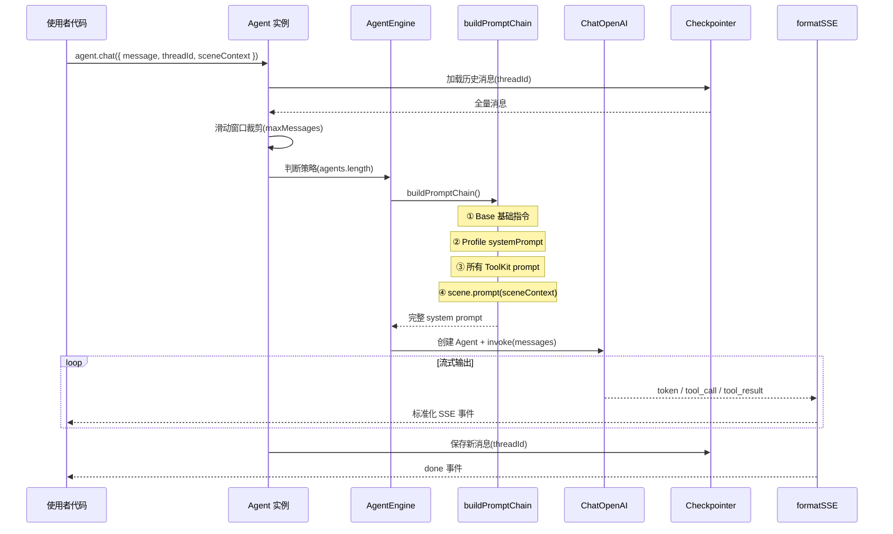
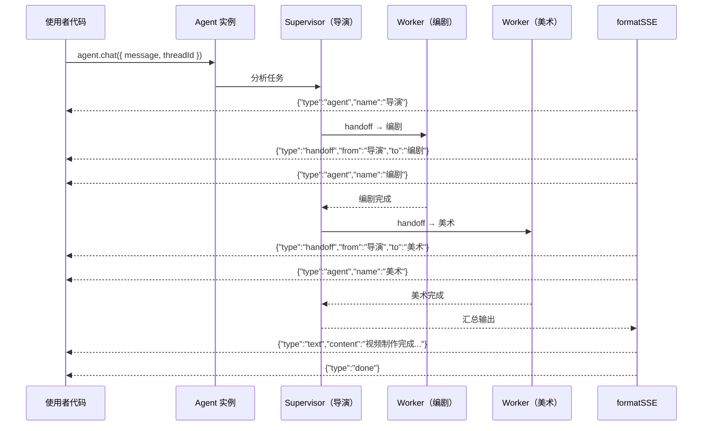
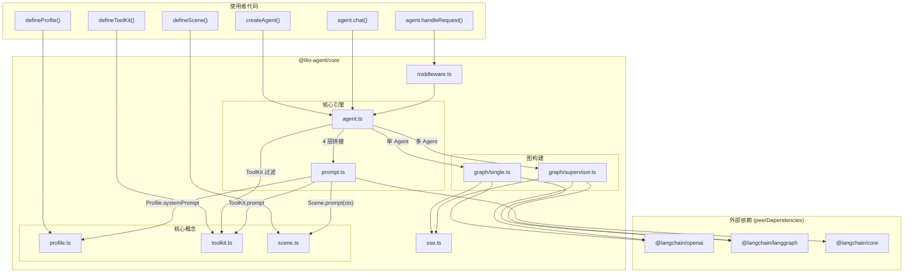
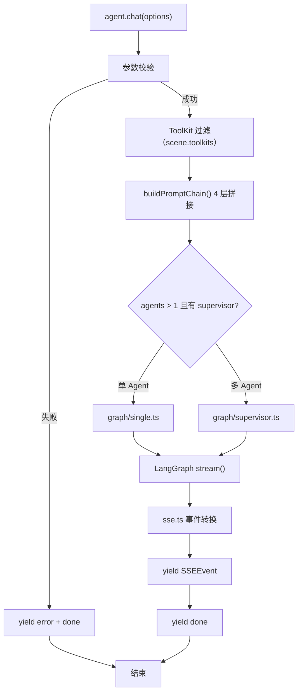

# @lilo-agent/core — 产品文档

## 一、用户需求

### 1.1 问题背景

LangChain 生态功能强大但 API 复杂、概念分散，直接使用存在以下痛点：
- 构建一个可流式输出的 Agent 需要手动组装 LLM、Tools、StateGraph、Callbacks 等多个模块，样板代码冗长
- 单 Agent 与多 Agent 协调（Supervisor 模式）的构建方式差异大，缺乏统一抽象
- 工具（Tools）和场景提示词散落在各处，难以跨项目复用
- SSE 事件流格式没有标准约束，前后端对接成本高

### 1.2 用户目标

构建 `@lilo-agent/core` TypeScript 库，封装 LangChain 编排复杂性。使用者只需关注三件事：

1. **ToolKit**（静态能力包）：按领域分组的工具集 + 使用策略 Prompt，全员共享
2. **Profile**（角色身份）：只写 name + systemPrompt + model
3. **Scene**（运行时上下文）：注入当前业务状态的 prompt 模板 + 生命周期回调，实例化时绑定

库自动处理：Prompt 4 层拼接、单/多 Agent 策略选择、SSE 流式输出。
记忆持久化与调试观测交给 LangChain 生态已有方案，库仅透传配置。

### 1.3 核心设计决策（讨论沉淀）

| # | 决策 | 结论 | 理由 |
|---|------|------|------|
| 1 | Scene 是否保留 | ✅ 保留 | Profile/ToolKit 是静态的，Scene 负责注入动态运行时上下文（当前页面状态、选中元素等） |
| 2 | Team 是否独立概念 | ❌ 融入参数 | `agents[]` + `supervisor?` 参数即可表达，不需要额外类型 |
| 3 | 单/多 Agent 是否区分 API | ❌ 统一入口 | 引擎内部根据 agents 数量自动判断策略，用户无感 |
| 4 | ToolKit 归属 | Scene 决定，Agent 共享 | ToolKit 在 createAgent 注册为全局能力池，Scene 声明当前场景需要哪些 ToolKit，场景内所有 Agent 共享这些 ToolKit。避免工具列表臃肿导致 token 浪费和 LLM 误选（详见 1.7） |
| 5 | 全局注册表 vs 实例持有 | 实例持有 | 全局注册表导致测试污染、多实例不可能、加载顺序依赖 |
| 6 | 核心 API 是否绑定 Express | ❌ 分离 | `agent.chat()` 是核心，`agent.handleRequest()` 是可选 HTTP 适配 |
| 7 | 记忆持久化 | LangGraph Checkpointer | 透传配置（MemorySaver / PostgresSaver），库不自建 |
| 8 | 上下文窗口管理 | 滑动窗口，库内置 | 默认取最近 N 条消息，Checkpointer 仍全量存储，库自动裁剪 |
| 9 | 调试观测方案 | LangFuse 自部署 | 透传 `callbacks` 配置项，库不内置调试功能 |
| 10 | API 文档 | TypeDoc 自动生成 | 从 TSDoc 注释自动生成，与代码永远同步，零维护成本 |

### 1.4 使用者视角的最终 API

```typescript
import { createAgent, defineProfile, defineToolKit, defineScene } from '@lilo-agent/core'
import { MemorySaver } from '@langchain/langgraph'
import { CallbackHandler } from '@langfuse/langchain'

// 1. 定义能力包（静态能力池）
const canvasToolKit = defineToolKit({
  name: 'canvas',
  tools: [bindElementTool, bindTrackTool],
  prompt: '画面调整时优先使用 canvas 工具...',
})

// 2. 定义角色（只写 Prompt）
const director = defineProfile({
  name: '导演',
  systemPrompt: '你是一位视频导演...',
  model: 'gpt-4o',
})

// 3. 定义场景（声明需要哪些 ToolKit + 动态运行时上下文）
const timelineScene = defineScene({
  name: 'timeline-editing',
  toolkits: ['canvas', 'ai'],              // ← Scene 决定此刻用哪些能力
  prompt: (ctx) => `用户在时间线编辑器，视频时长: ${ctx.duration}秒`,
  onToolEnd: (toolName, result) => {
    if (toolName === 'bindTrack') refreshTimeline()
  },
})

// 4. 创建实例（注册全局能力池 + 绑定场景，服务器启动时执行一次）
const agent = createAgent({
  toolkits: [canvasToolKit, aiToolKit, assetToolKit],   // 全局能力池
  agents: [director, screenwriter],
  supervisor: '导演',
  scene: timelineScene,              // ← 实例级别绑定场景
  checkpointer: new MemorySaver(),
  maxMessages: 50,
  callbacks: [new CallbackHandler()],
})

// 5. 核心调用（Scene 过滤出 canvas + ai 工具，所有 Agent 共享）
const stream = await agent.chat({
  message: '帮我调整第3秒的转场',
  threadId: 'thread-001',
  sceneContext: { duration: 30 },    // ← 只有动态数据跟请求走
})

// 6. Express 集成（可选薄封装）
app.post('/chat', agent.handleRequest())
```

### 1.5 关键约束

| 维度 | 约束 |
|------|------|
| 运行环境 | Node.js |
| 部署环境 | Docker（开发 WSL + 生产 Ubuntu） |
| HTTP 框架 | Express（可选适配，不耦合核心） |
| 包管理 | npm |
| 构建工具 | tsup |
| LangChain 依赖方式 | peerDependencies |
| 记忆持久化 | LangGraph Checkpointer（透传） |
| 调试观测 | LangFuse 自部署（透传 callbacks） |
| 语言 | TypeScript（严格模式） |

### 1.6 步骤拆分

#### 主流程（步骤 1）
- 单 Agent：Profile + ToolKit → agent.chat() → 流式响应
- Prompt 4 层拼接（Base → Profile → ToolKit → Scene）
- Scene 实例级绑定 + sceneContext 动态 prompt 注入 + ToolKit 过滤
- Checkpointer / Callbacks 透传
- SSE 协议层 + Express 适配
- npm 包结构 + tsup 构建

#### 功能步骤（步骤 2）
- 多 Agent（SupervisorStrategy + supervisor 参数）
- SSE handoff / agentName 事件
- Scene.onToolEnd 生命周期委托

#### 优化步骤（步骤 3）
- 错误处理 & 重试
- TypeDoc API 文档生成（npm run docs）
- Debug Panel 调试面板

### 1.7 ToolKit 归属设计理由

**问题**：如果所有 Agent 直接共享全部 ToolKit 会怎样？

假设全局有 4 个 ToolKit，每个 5 个工具 = 20 个工具：

| 场景 | 实际需要 | 全共享时 | 浪费 |
|------|---------|---------|------|
| 时间线编辑 | canvas + ai = 10 个工具 | 20 个工具 | 10 个无用工具 |
| 脚本编辑 | ai = 5 个工具 | 20 个工具 | 15 个无用工具 |

**全共享带来的三个问题**：

1. **Token 浪费**：每个工具的 schema 约 100-200 tokens，多 10 个无用工具 = 多 1500 tokens/请求。1000 用户 × 10 轮对话 = 每天浪费 1500 万 tokens
2. **LLM 误选**：工具越多，LLM 选错工具的概率越高。编剧 Agent 带着 canvas 工具，可能会在不该操作画面时去操作画面
3. **多 Agent 放大问题**：3 个 Worker 各带 20 个工具 = 60 份工具 schema，Supervisor 还要额外的 handoff 工具

**解决方案**：Scene 声明 `toolkits: ['canvas', 'ai']`，引擎从全局能力池中只取出这两个 ToolKit 的工具注入 Agent。

**为什么是 Scene 而不是 Profile 来决定**：
- Profile 是静态身份，不随业务变化。同一个"导演"在时间线编辑和脚本审阅中需要不同的工具集
- Scene 是"此刻在做什么"，自然决定"此刻需要什么工具"
- 不传 Scene 时，默认使用全部 ToolKit（向后兼容简单场景）

---

## 二、产品需求

### 2.1 核心概念规格

#### ToolKit — 静态能力包

| 字段 | 类型 | 必填 | 说明 |
|------|------|------|------|
| name | string | ✅ | 唯一标识（如 `'canvas'`、`'ai'`） |
| tools | StructuredTool[] | ✅ | LangChain Tool 数组 |
| prompt | string | ✅ | 使用策略提示词，告诉 LLM 何时/如何使用这组工具 |

- 注册到 createAgent 的全局能力池
- 纯数据：无状态、无副作用，服务器启动时定义一次

#### AgentProfile — 角色身份

| 字段 | 类型 | 必填 | 说明 |
|------|------|------|------|
| name | string | ✅ | 角色名称（如 `'导演'`），多 Agent 时作为唯一标识 |
| systemPrompt | string | ✅ | 角色系统提示词 |
| model | string | ✅ | 模型标识（如 `'gpt-4o'`、`'gpt-4o-mini'`） |

- 极简：使用者只需思考"这个 Agent 是谁"
- 不绑定工具、不绑定场景

#### Scene — 运行时上下文 + 工具集选择

| 字段 | 类型 | 必填 | 说明 |
|------|------|------|------|
| name | string | ✅ | 场景名称（如 `'timeline-editing'`） |
| toolkits | string[] | ✅ | 当前场景需要的 ToolKit 名称列表，从全局能力池中过滤 |
| prompt | (ctx) => string | ✅ | 动态提示词模板，接收运行时上下文数据 |
| onToolEnd | (toolName, result) => void | ❌ | 工具调用完成后的生命周期回调 |

- 在 `createAgent()` 时绑定，实例级别
- `toolkits` 决定当前场景下所有 Agent 可用的工具集合
- `prompt(ctx)` 在每次请求时执行，注入实时业务状态（ctx 来自 `chat()` 的 `sceneContext`）
- 不传 Scene 时，默认使用全部 ToolKit

#### AgentOptions — createAgent() 配置

| 字段 | 类型 | 必填 | 默认值 | 说明 |
|------|------|------|--------|------|
| toolkits | ToolKit[] | ✅ | — | 全局能力池，所有可用的 ToolKit |
| agents | AgentProfile[] | ✅ | — | Agent 列表 |
| supervisor | string | ❌ | — | supervisor 的 agent name，有值则启用多 Agent |
| scene | Scene | ❌ | — | 运行时场景，决定工具集过滤和动态 Prompt |
| checkpointer | BaseCheckpointSaver | ❌ | MemorySaver | LangGraph Checkpointer 实例 |
| maxMessages | number | ❌ | 50 | 滑动窗口大小 |
| callbacks | Callbacks[] | ❌ | [] | LangChain Callbacks（如 LangFuse） |

#### ChatOptions — agent.chat() 参数

| 字段 | 类型 | 必填 | 说明 |
|------|------|------|------|
| message | string | ✅ | 用户消息 |
| threadId | string | ✅ | 对话线程 ID，用于记忆隔离 |
| sceneContext | Record<string, any> | ❌ | 传给 scene.prompt(ctx) 的动态数据 |

### 2.2 SSE 事件协议

`agent.chat()` 返回 `AsyncGenerator`，产出标准化 SSE 事件：

| 事件类型 | 触发时机 | payload |
|---------|---------|---------|
| `text` | LLM 输出文本 token | `{ content: string }` |
| `tool_start` | 工具调用开始 | `{ toolName: string, input: Record<string, any> }` |
| `tool_end` | 工具调用结束 | `{ toolName: string, output: any }` |
| `handoff` | Agent 切换（多 Agent） | `{ from: string, to: string }` |
| `agent` | 当前回答的 Agent 身份 | `{ name: string }` |
| `error` | 执行出错 | `{ message: string }` |
| `done` | 流结束 | `{}` |

SSE 格式示例：
```
data: {"type":"agent","name":"导演"}

data: {"type":"text","content":"我来"}

data: {"type":"text","content":"帮你"}

data: {"type":"tool_start","toolName":"bindTrack","input":{"trackId":"track-01"}}

data: {"type":"tool_end","toolName":"bindTrack","output":{"success":true}}

data: {"type":"text","content":"已经完成转场调整。"}

data: {"type":"done"}

```

### 2.3 主流程时序



### 2.4 多 Agent 时序（步骤 2）



### 2.5 验收标准

#### 步骤 1：单 Agent 端到端闭环

| # | 验收项 | 标准 |
|---|--------|------|
| 1 | 基础对话 | 定义 1 个 Profile，调用 `agent.chat()` 返回流式文本响应 |
| 2 | ToolKit 集成 | 注册 ToolKit 后，Agent 能正确调用工具并返回 `tool_start` / `tool_end` 事件 |
| 3 | Scene 注入 | 传入 Scene + sceneContext，Prompt 中包含动态上下文内容 |
| 4 | 记忆连续 | 同一 threadId 多次 chat，Agent 记得之前的对话 |
| 5 | 滑动窗口 | 超过 maxMessages 条消息后，早期消息不发给 LLM（但 Checkpointer 仍全量存储） |
| 6 | Express 适配 | `agent.handleRequest()` 挂载 Express 路由，前端通过 SSE 接收事件流 |
| 7 | npm 包 | `npm run build` 产出 ESM + CJS + .d.ts，可被外部项目安装使用 |

#### 步骤 2：多 Agent 协作

| # | 验收项 | 标准 |
|---|--------|------|
| 1 | 自动切换 | 配置 `supervisor` 后，引擎自动启用 SupervisorStrategy |
| 2 | 任务分派 | Supervisor 根据任务自动 handoff 给合适的 Worker |
| 3 | SSE 事件 | 流中包含 `handoff` 和 `agent` 事件，前端可感知当前谁在回答 |
| 4 | 生命周期 | Scene.onToolEnd 在工具调用完成后正确触发 |

#### 步骤 3：优化

| # | 验收项 | 标准 |
|---|--------|------|
| 1 | 错误处理 | LLM 调用失败时返回 `error` 事件，不崩溃 |
| 2 | API 文档 | `npm run docs` 生成完整 TypeDoc 文档 |

## 三、UI 需求

本项目为纯后端库，无 UI。API 设计即"UI"，核心体验目标：
- 3 分钟快速上手：安装 → 定义 Profile → 挂载路由 → 对话
- 声明式 API，隐藏 LangChain 复杂性
- TypeScript 类型提示完备，TSDoc 注释详尽

## 四、技术选型

| 项 | 选型 | 理由 |
|----|------|------|
| 语言 | TypeScript（严格模式） | 类型安全，TSDoc 驱动 API 文档 |
| 构建工具 | tsup | 零配置产出 ESM + CJS + .d.ts |
| LLM 框架 | @langchain/openai + @langchain/langgraph | 成熟的 Agent 编排 + 流式输出 |
| 依赖方式 | peerDependencies | 避免版本冲突，使用者自行安装 LangChain |
| 记忆持久化 | LangGraph Checkpointer（透传） | MemorySaver（开发）/ PostgresSaver（生产） |
| 调试观测 | LangFuse（透传 callbacks） | 自部署，库不内置 |
| HTTP 适配 | Express（可选） | `agent.handleRequest()` 薄封装，不耦合核心 |
| 包管理 | npm | 项目统一 |
| API 文档 | TypeDoc | 从 TSDoc 注释自动生成 |

## 五、架构设计

### 5.1 设计原则

- **代码结构映射概念模型**：使用者理解 3 个概念（Profile、ToolKit、Scene），代码围绕概念组织，不围绕架构模式组织
- **不过早抽象**：先写对，再看是否需要拆。一个函数能解决的不拆成一个目录
- **变化隔离**：唯一有实质差异的是"单 Agent 图 vs 多 Agent 图"，只在 `graph/` 目录体现这个变化点

### 5.2 系统架构图



### 5.3 目录结构

```
@lilo-agent/core/
├── src/                      # 库源码
│   ├── index.ts              # 公共导出
│   ├── types.ts              # 所有类型定义
│   ├── agent.ts              # Agent 类 + createAgent()（核心，串联完整流程）
│   ├── profile.ts            # defineProfile() 工厂函数
│   ├── toolkit.ts            # defineToolKit() 工厂函数
│   ├── scene.ts              # defineScene() 工厂函数
│   ├── prompt.ts             # buildPromptChain() 4 层拼接
│   ├── graph/                # LangGraph 图构建（唯一的变化点）
│   │   ├── single.ts         # 单 Agent 图：createReactAgent
│   │   └── supervisor.ts     # 多 Agent 图：createSupervisor
│   ├── sse.ts                # SSE 事件定义 + 格式化 + 流事件转换
│   └── middleware.ts         # Express 中间件（handleRequest）
├── playground/               # 调试测试工具（不发布）
│   ├── server.cjs            # 测试服务器
│   └── public/               # 静态前端页面
├── docs/                     # 项目文档
├── dist/                     # 构建产物
├── package.json
├── tsconfig.json
└── tsup.config.ts
```

10 个文件，三个核心概念各有对应的 `define` 工厂函数，API 统一。

### 5.4 模块职责

| 文件 | 职责 | 说明 |
|------|------|------|
| `types.ts` | 全部类型定义 | ToolKit / AgentProfile / Scene / AgentOptions / ChatOptions / SSEEvent |
| `agent.ts` | 核心入口 | 参数校验 → ToolKit 过滤 → Prompt 拼接 → 图构建 → 流式输出，一条直线串联 |
| `profile.ts` | `defineProfile()` | 校验必填字段 + 返回冻结对象 |
| `toolkit.ts` | `defineToolKit()` | 校验必填字段 + tools 非空 + 返回冻结对象 |
| `scene.ts` | `defineScene()` | 校验必填字段 + toolkits 非空 + 返回冻结对象 |
| `prompt.ts` | Prompt 4 层拼接 | 纯函数：Base → Profile → ToolKit → Scene |
| `graph/single.ts` | 单 Agent 图 | 封装 `createReactAgent` + `stream()` |
| `graph/supervisor.ts` | 多 Agent 图 | 封装 `createSupervisor` + Workers + `stream()` |
| `sse.ts` | SSE 协议层 | 事件类型定义、LangGraph 事件 → SSEEvent 转换、`data: JSON\n\n` 格式化 |
| `middleware.ts` | Express 适配 | SSE Headers + 流式写入 + 错误兜底 |

### 5.5 请求处理流程



**核心逻辑在 `agent.ts` 一个文件中串联**，不做不必要的跳转。

### 5.6 Prompt 4 层拼接

```
① Base       — 库内置固定指令（通用行为约束、防御性指令）
② Profile    — agent.systemPrompt（角色身份）
③ ToolKit    — 当前场景激活的 ToolKit.prompt（0~N 个）
④ Scene      — scene.prompt(sceneContext)（仅绑定 Scene 时）
```

各层 `\n\n` 拼接，合并为单条 SystemMessage。

### 5.7 错误处理

**原则**：任何情况下不崩溃，以 `error` + `done` 事件正常结束流。

| 错误场景 | 处理 |
|---------|------|
| 参数校验失败 | yield `error`，不发起 LLM 调用 |
| LLM API 异常 | catch → yield `error` |
| 工具执行异常 | LangGraph 内置处理，失败后 yield `error` |
| Checkpointer 异常 | 降级无记忆模式，yield `error` 提示 |
| 未知异常 | 全局 try-catch → yield `error` + `done` |

## 六、代码设计

### 6.1 核心类型 (`types.ts`)

```typescript
import type { StructuredToolInterface } from '@langchain/core/tools'
import type { BaseCheckpointSaver } from '@langchain/langgraph'
import type { BaseCallbackHandler } from '@langchain/core/callbacks/base'

/** 静态能力包 */
export interface ToolKit {
  readonly name: string
  readonly tools: StructuredToolInterface[]
  readonly prompt: string
}

/** 角色身份 */
export interface AgentProfile {
  readonly name: string
  readonly systemPrompt: string
  readonly model: string
}

/** 运行时场景 */
export interface Scene {
  readonly name: string
  readonly toolkits: string[]
  readonly prompt: (ctx: Record<string, any>) => string
  readonly onToolEnd?: (toolName: string, result: any) => void
}

/** createAgent() 配置项 */
export interface AgentOptions {
  toolkits: ToolKit[]
  agents: AgentProfile[]
  supervisor?: string
  scene?: Scene
  checkpointer?: BaseCheckpointSaver
  maxMessages?: number
  callbacks?: BaseCallbackHandler[]
}

/** agent.chat() 参数 */
export interface ChatOptions {
  message: string
  threadId: string
  sceneContext?: Record<string, any>
}

/** 标准化 SSE 事件 */
export type SSEEvent =
  | { type: 'text'; content: string }
  | { type: 'tool_start'; toolName: string; input: Record<string, any> }
  | { type: 'tool_end'; toolName: string; output: any }
  | { type: 'handoff'; from: string; to: string }
  | { type: 'agent'; name: string }
  | { type: 'error'; message: string }
  | { type: 'done' }
```

### 6.2 Agent 类 (`agent.ts`)

```typescript
import { MemorySaver } from '@langchain/langgraph'
import { buildPromptChain } from './prompt'
import { buildSingleGraph } from './graph/single'
import { buildSupervisorGraph } from './graph/supervisor'
import { transformStream, formatSSE } from './sse'
import type { AgentOptions, ChatOptions, SSEEvent } from './types'

class Agent {
  private readonly options: AgentOptions & {
    maxMessages: number
    callbacks: BaseCallbackHandler[]
    checkpointer: BaseCheckpointSaver
  }

  constructor(options: AgentOptions) {
    this.options = {
      maxMessages: 50,
      callbacks: [],
      checkpointer: new MemorySaver(),
      ...options,
    }
    this.validate()
  }

  async *chat(options: ChatOptions): AsyncGenerator<SSEEvent> {
    try {
      // 1. ToolKit 过滤 — 直接内联，不值得单独文件
      const scene = this.options.scene
      const activeToolkits = scene
        ? this.options.toolkits.filter(tk => scene.toolkits.includes(tk.name))
        : this.options.toolkits
      const tools = activeToolkits.flatMap(tk => tk.tools)
      const toolkitPrompts = activeToolkits.map(tk => tk.prompt)

      // 2. Prompt 4 层拼接
      const systemPrompt = buildPromptChain({
        profile: this.options.agents[0],
        toolkitPrompts,
        scene,
        sceneContext: options.sceneContext,
      })

      // 3. 构建 LangGraph 图 + stream
      const hasMultiAgent = this.options.agents.length > 1 && !!this.options.supervisor
      const stream = hasMultiAgent
        ? await buildSupervisorGraph({ systemPrompt, tools, ...this.options, ...options })
        : await buildSingleGraph({ systemPrompt, tools, ...this.options, ...options })

      // 4. 转换流事件 → 标准化 SSE 事件
      yield* transformStream(stream, scene?.onToolEnd)
      yield { type: 'done' }
    } catch (err) {
      yield { type: 'error', message: String(err) }
      yield { type: 'done' }
    }
  }

  handleRequest(): RequestHandler {
    return createExpressHandler(this)
  }

  private validate(): void {
    if (!this.options.agents.length) {
      throw new Error('At least one agent is required')
    }
    if (this.options.supervisor) {
      const found = this.options.agents.find(a => a.name === this.options.supervisor)
      if (!found) throw new Error(`Supervisor "${this.options.supervisor}" not found`)
    }
  }
}

export function createAgent(options: AgentOptions): Agent {
  return new Agent(options)
}
```

### 6.3 工厂函数 (`profile.ts` / `toolkit.ts` / `scene.ts`)

```typescript
// profile.ts
export function defineProfile(input: AgentProfile): Readonly<AgentProfile> {
  if (!input.name) throw new Error('Profile name is required')
  if (!input.systemPrompt) throw new Error('Profile systemPrompt is required')
  if (!input.model) throw new Error('Profile model is required')
  return Object.freeze({ ...input })
}

// toolkit.ts
export function defineToolKit(input: ToolKit): Readonly<ToolKit> {
  if (!input.name) throw new Error('ToolKit name is required')
  if (!input.tools?.length) throw new Error('ToolKit tools must not be empty')
  if (!input.prompt) throw new Error('ToolKit prompt is required')
  return Object.freeze({ ...input })
}

// scene.ts
export function defineScene(input: Scene): Readonly<Scene> {
  if (!input.name) throw new Error('Scene name is required')
  if (!input.toolkits?.length) throw new Error('Scene toolkits must not be empty')
  if (typeof input.prompt !== 'function') throw new Error('Scene prompt must be a function')
  return Object.freeze({ ...input })
}
```

三个工厂函数职责一致：校验必填字段 → 返回冻结对象。

### 6.4 Prompt 拼接 (`prompt.ts`)

```typescript
const BASE_PROMPT = `你是一个AI助手。请遵循以下规则：
- 使用与用户相同的语言回复
- 不要编造不确定的信息
- 工具调用时严格按照参数 schema`

export function buildPromptChain(params: {
  profile: AgentProfile
  toolkitPrompts: string[]
  scene?: Scene
  sceneContext?: Record<string, any>
}): string {
  const layers: string[] = [
    BASE_PROMPT,
    params.profile.systemPrompt,
    ...params.toolkitPrompts,
  ]

  if (params.scene && params.sceneContext) {
    layers.push(params.scene.prompt(params.sceneContext))
  }

  return layers.filter(Boolean).join('\n\n')
}
```

### 6.5 单 Agent 图 (`graph/single.ts`)

```typescript
export async function buildSingleGraph(params: {
  systemPrompt: string
  tools: StructuredToolInterface[]
  agents: AgentProfile[]
  message: string
  threadId: string
  checkpointer: BaseCheckpointSaver
  maxMessages: number
  callbacks: BaseCallbackHandler[]
}) {
  const graph = createReactAgent({
    llm: new ChatOpenAI({ model: params.agents[0].model }),
    tools: params.tools,
    checkpointSaver: params.checkpointer,
    prompt: params.systemPrompt,
  })

  return graph.stream(
    { messages: [new HumanMessage(params.message)] },
    {
      configurable: { thread_id: params.threadId },
      recursionLimit: 25,
    },
  )
}
```

### 6.6 SSE 协议层 (`sse.ts`)

```typescript
/** LangGraph stream → 标准化 SSEEvent */
export async function* transformStream(
  stream: AsyncIterable<StreamEvent>,
  onToolEnd?: (toolName: string, result: any) => void,
): AsyncGenerator<SSEEvent> {
  for await (const chunk of stream) {
    // LangGraph 事件 → SSEEvent 映射
    // 实际实现在开发阶段对接 LangGraph API 后确定
  }
}

/** SSE 格式化 */
export function formatSSE(event: SSEEvent): string {
  return `data: ${JSON.stringify(event)}\n\n`
}

/** SSE 响应头 */
export function writeSSEHeaders(res: Response): void {
  res.setHeader('Content-Type', 'text/event-stream')
  res.setHeader('Cache-Control', 'no-cache')
  res.setHeader('Connection', 'keep-alive')
  res.setHeader('X-Accel-Buffering', 'no')
}
```

### 6.7 Express 中间件 (`middleware.ts`)

```typescript
export function createExpressHandler(agent: Agent): RequestHandler {
  return async (req, res) => {
    writeSSEHeaders(res)
    try {
      for await (const event of agent.chat(req.body)) {
        res.write(formatSSE(event))
      }
    } catch (err) {
      res.write(formatSSE({ type: 'error', message: String(err) }))
    } finally {
      res.end()
    }
  }
}
```

### 6.8 公共导出 (`index.ts`)

```typescript
export { createAgent } from './agent'
export { defineProfile } from './profile'
export { defineToolKit } from './toolkit'
export { defineScene } from './scene'
export type {
  AgentOptions,
  AgentProfile,
  ChatOptions,
  Scene,
  SSEEvent,
  ToolKit,
} from './types'
```

## 七、开发计划

### 步骤 1：项目骨架 + 单 Agent 闭环

- [x] 1.1 初始化 `packages/core/`：package.json、tsconfig.json、tsup.config.ts
- [x] 1.2 定义核心类型 `types.ts`
- [x] 1.3 实现工厂函数 `profile.ts` / `toolkit.ts` / `scene.ts`
- [x] 1.4 实现 `prompt.ts`（buildPromptChain 4 层拼接）
- [x] 1.5 实现 `graph/single.ts` + `sse.ts`（单 Agent 图构建 + 流事件转换）
- [x] 1.6 实现 `agent.ts`（Agent 类 + createAgent）
- [x] 1.7 实现 `middleware.ts`（Express 中间件 + handleRequest）
- [x] 1.8 实现 `index.ts` 公共导出
- [x] 1.9 构建验证：`npm run build` 产出 ESM + CJS + .d.ts

### 步骤 2：多 Agent 协作

- [x] 2.1 实现 `graph/supervisor.ts`（多 Agent 图构建）
- [x] 2.2 `agent.ts` 补充多 Agent 分支逻辑
- [x] 2.3 `sse.ts` 补充 `handoff` / `agent` 事件转换
- [x] 2.4 Scene.onToolEnd 生命周期回调触发

### 步骤 3：健壮性 + 文档

- [ ] 3.1 全链路错误处理（参数校验 / LLM 异常 / 工具异常 / Checkpointer 异常）
- [ ] 3.2 TypeDoc 配置 + TSDoc 注释补全 + `npm run docs`

