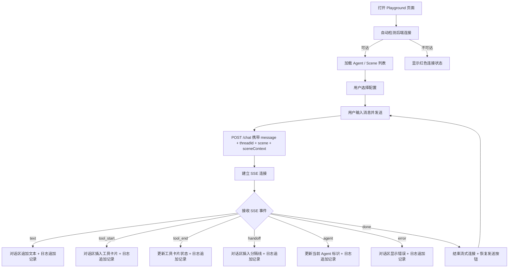

# Debug Playground — 产品文档

> 关联文档：[agent-kit-core.md](./lilo-agent-core.md)

## 一、用户需求

### 1.1 问题背景

`@lilo-agent/core` 开发过程中，验证 SSE 事件流、对话交互、工具调用等行为只能依赖命令行工具（curl / Postman），存在以下痛点：

- SSE 流式事件无法直观观察，curl 输出是原始文本，难以区分事件类型
- 多轮对话的记忆连续性验证需要反复拼接 threadId 参数，操作繁琐
- 工具调用的入参/出参缺乏结构化展示，排查问题效率低
- 切换 Scene、Agent Profile 等配置需要修改代码并重启服务，调试循环慢

### 1.2 用户目标

构建一个**轻量级单页调试面板**（Debug Playground），嵌入项目仓库，辅助 `@lilo-agent/core` 的开发调试。核心能力：

1. **对话调试**：发送消息，实时渲染流式响应（文本逐字输出、工具调用过程可视化）
2. **配置切换**：在界面上切换 Scene、Agent Profile 等运行时配置，无需改代码重启
3. **SSE 事件日志**：展示原始 SSE 事件流，每条事件带类型标签和时间戳，便于协议级调试
4. **会话管理**：支持 threadId 管理，可新建/切换会话以验证记忆隔离

### 1.3 关键约束

| 维度 | 约束 |
|------|------|
| 定位 | 开发调试工具，非面向最终用户的产品 UI |
| 形态 | 单页面 SPA |
| 位置 | 项目仓库内（如 `packages/playground`） |
| 复杂度 | 轻量级，够用即可，不追求复杂工程体系 |
| 后端依赖 | 调用 `kit.handleRequest()` 暴露的 Express 路由 |
| 设计风格 | Linear 风格（暗色主题、简洁克制） |

### 1.4 非目标

- ❌ 不做用户认证/权限系统
- ❌ 不做持久化存储（刷新页面可丢失状态）
- ❌ 不做移动端适配
- ❌ 不做国际化

## 二、产品需求

### 2.1 页面布局

三栏式布局，水平并排：

| 区域 | 位置 | 宽度策略 | 职责 |
|------|------|---------|------|
| 配置面板 | 左侧 | 固定宽度 280px | 运行时配置切换 |
| 对话区 | 中间 | 弹性填充（flex: 1） | 消息交互主区域 |
| 事件日志 | 右侧 | 固定宽度 360px | 原始 SSE 事件流 |

页面顶部无全局导航栏，三栏直接铺满视口高度（100vh）。

---

### 2.2 配置面板（左侧）

#### 2.2.1 会话管理

| 功能点 | 说明 |
|--------|------|
| threadId 显示 | 当前会话 ID，显示为截断文本（如 `thread-a3f...`） |
| 新建会话 | 按钮，点击生成新的 UUID 作为 threadId，清空对话区 |
| 会话列表 | 历史 threadId 列表（仅内存态），点击切换，切换后对话区清空（记忆在服务端） |

#### 2.2.2 Agent 配置

| 功能点 | 说明 |
|--------|------|
| Agent 选择 | 下拉菜单，列出后端注册的所有 AgentProfile name |
| 当前 Agent 信息 | 选中后显示 name、model 等只读信息 |

> 说明：Agent 列表从后端接口获取（需新增 `GET /debug/agents` 接口）

#### 2.2.3 Scene 配置

| 功能点 | 说明 |
|--------|------|
| Scene 选择 | 下拉菜单，列出后端注册的所有 Scene name，含"无 Scene"选项 |
| sceneContext 编辑 | JSON 编辑器（等宽字体文本框），用户手动输入当前场景的上下文数据 |
| 语法校验 | 输入非法 JSON 时，边框变红 + 错误提示 |

> 说明：Scene 列表从后端接口获取（需新增 `GET /debug/scenes` 接口）

#### 2.2.4 连接状态

| 功能点 | 说明 |
|--------|------|
| 状态指示器 | 绿色圆点 = 后端可达 / 红色圆点 = 不可达 |
| 后端地址 | 显示当前连接的后端 URL（如 `http://localhost:3000`） |

---

### 2.3 对话区（中间）

#### 2.3.1 消息列表

| 功能点 | 说明 |
|--------|------|
| 用户消息 | 右对齐气泡，显示用户发送的文本 |
| AI 消息 | 左对齐气泡，支持 Markdown 渲染 |
| Agent 标识 | AI 消息气泡上方显示当前回答的 Agent name（收到 `agent` 事件时更新） |
| 流式渲染 | 收到 `text` 事件时逐步追加文本，模拟打字效果 |
| 自动滚动 | 新消息到来时自动滚动到底部 |

#### 2.3.2 工具调用展示

| 功能点 | 说明 |
|--------|------|
| 工具卡片 | 收到 `tool_start` 时在消息流中插入折叠卡片 |
| 卡片标题 | 工具名称 + 状态（🔄 执行中 / ✅ 完成） |
| 展开内容 | 入参（`tool_start.input`）+ 出参（`tool_end.output`），JSON 格式化展示 |
| 默认折叠 | 默认折叠状态，点击展开 |

#### 2.3.3 Handoff 展示（多 Agent）

| 功能点 | 说明 |
|--------|------|
| 分隔指示 | 收到 `handoff` 事件时，在消息流中插入一条水平分隔线 |
| 分隔文案 | 显示 `from → to`（如 `导演 → 编剧`） |

#### 2.3.4 错误展示

| 功能点 | 说明 |
|--------|------|
| 错误消息 | 收到 `error` 事件时，在消息流中显示红色错误卡片，内容为 `error.message` |

#### 2.3.5 输入区

| 功能点 | 说明 |
|--------|------|
| 文本输入框 | 底部固定，支持多行（Shift+Enter 换行），Enter 发送 |
| 发送按钮 | 输入框右侧，点击发送 |
| 发送中状态 | 流式响应进行中时，发送按钮变为 Stop 按钮，点击中断流 |
| 空消息拦截 | 输入为空时禁用发送 |

---

### 2.4 事件日志（右侧）

#### 2.4.1 事件列表

| 功能点 | 说明 |
|--------|------|
| 实时追加 | 每收到一个 SSE 事件，在列表底部追加一条记录 |
| 自动滚动 | 新事件到来时自动滚动到底部 |

#### 2.4.2 单条事件

| 功能点 | 说明 |
|--------|------|
| 类型标签 | 彩色标签：`text`(蓝) / `tool_start`(橙) / `tool_end`(绿) / `handoff`(紫) / `agent`(青) / `error`(红) / `done`(灰) |
| 时间戳 | 精确到毫秒（如 `14:23:01.456`），显示在右侧 |
| Payload | JSON 格式化展示，默认折叠，点击展开 |

#### 2.4.3 操作

| 功能点 | 说明 |
|--------|------|
| 清空日志 | 顶部按钮，清空所有事件记录 |
| 类型过滤 | 点击类型标签可切换过滤（如只看 `tool_start` + `tool_end`） |

---

### 2.5 调试辅助接口（后端新增）

Playground 需要后端提供以下调试专用接口：

| 接口 | 方法 | 说明 |
|------|------|------|
| `/debug/agents` | GET | 返回所有已注册 AgentProfile 列表（name, model） |
| `/debug/scenes` | GET | 返回所有已注册 Scene 列表（name, toolkits） |
| `/debug/config` | GET | 返回当前 Kit 配置摘要（maxMessages, supervisor 等） |

这些接口由 `kit.handleDebugRequest()` 提供，与 `kit.handleRequest()` 同级，开发模式下挂载。

---

### 2.6 业务流程图



### 2.7 验收标准

| # | 验收项 | 标准 |
|---|--------|------|
| 1 | 基础对话 | 输入消息，流式渲染 AI 回复文本 |
| 2 | 工具可视化 | 工具调用过程以折叠卡片展示，可查看入参/出参 |
| 3 | 配置切换 | 切换 Scene / Agent 后发送消息，后端按新配置响应 |
| 4 | 事件日志 | 右侧面板实时展示每条 SSE 事件，带类型标签和时间戳 |
| 5 | 会话管理 | 新建会话切换 threadId，验证记忆隔离 |
| 6 | 连接状态 | 后端不可达时显示红色状态指示 |
| 7 | 错误展示 | 后端返回 error 事件时，对话区和日志均正确展示 |

## 三、UI 需求

> 遵循 [Linear 设计风格指南](./coding/设计风格-linear.md)

### 3.1 整体布局

三栏并排，100vw × 100vh，无全局导航栏，各栏内部独立滚动。

```
┌──────────┬────────────────────────────┬────────────────┐
│          │                            │                │
│ 配置面板  │         对话区              │   事件日志      │
│ 280px    │        flex: 1             │   360px        │
│          │                            │                │
│          ├────────────────────────────┤                │
│          │       输入区 (固定底部)      │                │
└──────────┴────────────────────────────┴────────────────┘
```

- 三栏之间用 `1px` 细线分隔（比背景稍亮的灰色）
- 各栏内部独立滚动，外层无滚动

---

### 3.2 配置面板（左侧 280px）

从上到下排列，区块间距 24px，区块标题用 11px 大写 + 字间距（Linear 经典标签风格）。

- **连接状态**：顶部，圆点 6px（绿=可达 / 红=断开）+ 状态文字 + 后端地址
- **会话列表**：标题 `SESSIONS` + `+` 按钮，选中项左侧 2px 强调色竖线
- **Agent 下拉**：标题 `AGENT`，选中后下方显示 model 信息
- **Scene 下拉**：标题 `SCENE`，选中后下方显示 toolkits 列表
- **Context 编辑器**：标题 `CONTEXT`，等宽字体 textarea，非法 JSON 时边框变红 + 错误提示

---

### 3.3 对话区（中间 flex:1）

- **用户消息**：右对齐，强调色背景，白色文字，最大宽度 70%
- **AI 消息**：左对齐，卡片背景色，上方显示 Agent name（次级文本 12px）
- **工具卡片**：左侧 2px 彩色竖线（执行中=橙 / 完成=绿），默认折叠，展开显示 Input/Output JSON
- **Handoff 分隔线**：虚线 + 居中文案 `from → to`
- **错误卡片**：左侧 2px 红色竖线，浅红底色
- **输入区**：底部固定，输入框 + 发送/停止按钮，Enter 发送，Shift+Enter 换行

---

### 3.4 事件日志（右侧 360px）

- **头部**：标题 `EVENT LOG` + `Clear` 按钮 + 类型过滤标签栏
- **事件条目**：类型标签（带对应色彩）+ 毫秒时间戳 + payload 折叠/展开
- **类型色彩**：text=蓝 / tool_start=橙 / tool_end=绿 / handoff=紫 / agent=青 / error=红 / done=灰

---

### 3.5 交互动效

所有过渡 150ms ease-out，克制不浮夸：hover 背景渐变、工具卡片展开/折叠、消息淡入、输入框 focus 边框变色。

---

## 四、技术选型

### 4.1 前端

| 项 | 选型 | 理由 |
|----|------|------|
| 技术 | **纯 HTML + CSS + JS** | 调试工具，极致轻量，零构建依赖 |
| 页面提供方式 | **后端路由直出** | `kit.handlePlayground()` 返回 HTML 字符串，Express 路由 `GET /playground` 直接响应 |
| SSE 接收 | **原生 fetch + ReadableStream** | 浏览器原生，无需额外库 |
| ID 生成 | **crypto.randomUUID()** | 浏览器原生 API，生成 threadId |

### 4.2 页面提供方式

HTML/CSS/JS 以**模板字符串**形式内嵌在 `@lilo-agent/core` 源码中（单文件），由 `kit.handlePlayground()` 返回 Express 中间件：

```typescript
// 使用者只需一行
app.use(kit.handlePlayground())
// 访问 GET /playground 即可打开调试面板
```

优势：
- 零额外依赖，不需要 `packages/playground` 目录
- 与库版本绑定，不存在前后端版本不一致问题
- 使用者无需任何前端构建流程

### 4.3 后端新增接口

| 接口 | 方法 | 说明 |
|------|------|------|
| `GET /playground` | GET | 返回 HTML 页面 |
| `GET /playground/api/agents` | GET | 返回所有已注册 AgentProfile |
| `GET /playground/api/scenes` | GET | 返回所有已注册 Scene |
| `GET /playground/api/config` | GET | 返回当前 Kit 配置摘要 |
| `POST /playground/api/chat` | POST | 对话接口，返回 SSE 流 |

所有接口由 `kit.handlePlayground()` 统一挂载到 `/playground` 路径下。

## 五、架构设计

（待完善）

## 六、代码设计

（待完善）

## 七、开发计划

（待完善）

